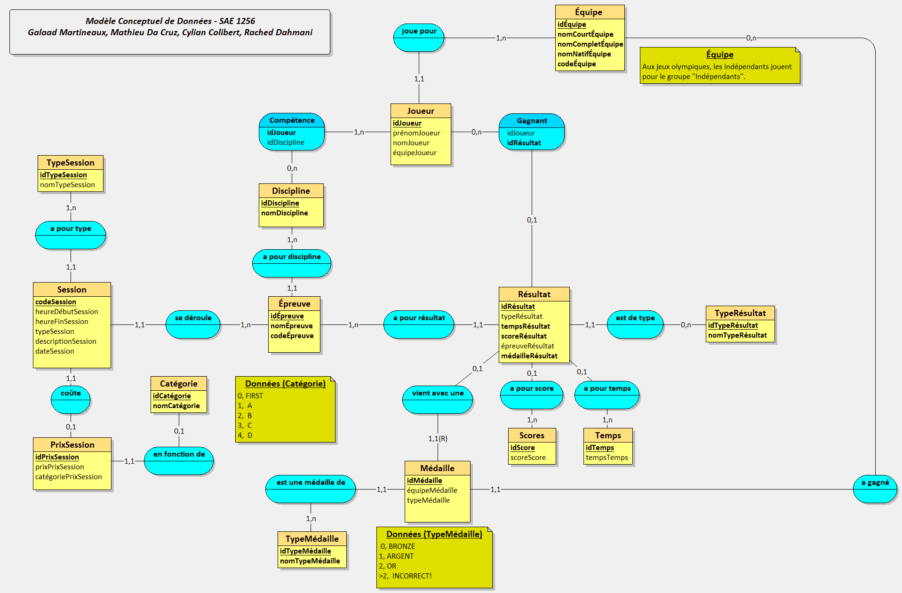
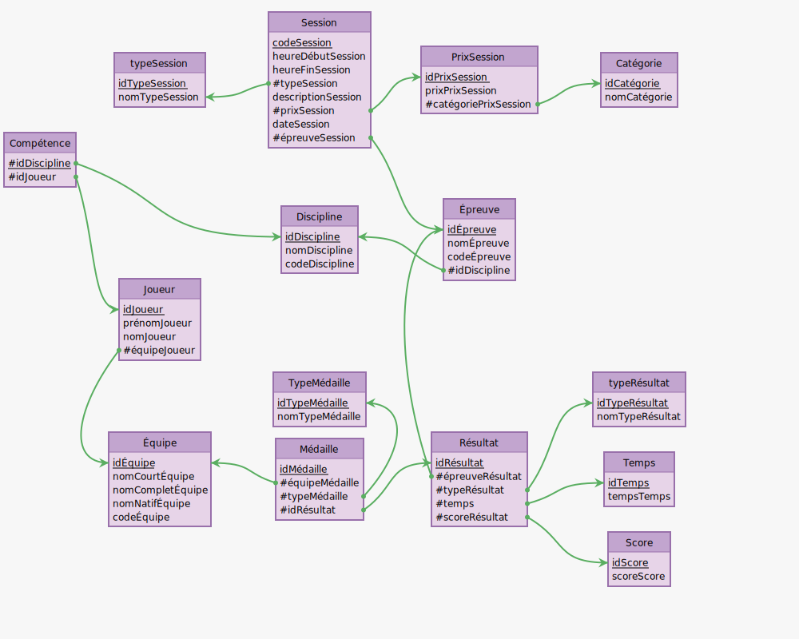

# Partie "Analyse et Qualité" (JC)
Par Galaad Martineaux, Cylian Colibert, Rached Dahmani, et Matthieu Da Cruz.

## Dossier d'analyse fonctionnelle
### Diagramme des interactions

### Organigramme technique

### Logigramme pour une des fonctionnalités étendues

## Base de données
### Modèle Conceptuel de Données (MCD)

### Schéma relationnel

### Dictionnaire des données
#### Table Pays

| Nom de l'attribut | Type         | Description |
|--------------------|--------------|-------------|
| idPays             | Attribut     | Identifiant du Pays |
| nomCourtPays       | Attribut     | Nom Court du Pays (Ex: République de France->France) |
| nomCompletPays     | Attribut     | Nom complet et officiel du pays |
| nomNatifPays       | Attribut     | Nom du pays dans sa langue native |
| codePays           | Attribut     | Code du pays (France->FR) |

#### Table Discipline

| Nom de l'attribut | Type         | Description |
|--------------------|--------------|-------------|
| idDiscipline       | Attribut     | Identifiant de la discipline |
| nomDiscipline      | Attribut     | Nom de la discipline |

#### Table TypeMédaille

| Nom de l'attribut | Type         | Description |
|--------------------|--------------|-------------|
| idTypeMédaille     | Attribut     | Identifiant du type de médaille |
| nomTypeMédaille    | Attribut     | Nom du type de médaille (Bronze, or, argent) |

#### Table Catégorie

| Nom de l'attribut | Type         | Description |
|--------------------|--------------|-------------|
| idCatégorie        | Attribut     | Identifiant de la catégorie de place |
| nomCatégorie      | Attribut     | Nom de la catégorie de place |

#### Table PrixSession

| Nom de l'attribut | Type         | Description |
|--------------------|--------------|-------------|
| idPrixSession      | Attribut     | Identifiant du prix des places pour une catégorie et une session |
| prixPrixSession    | Attribut     | prix des places pour une catégorie et une session |
| catégoriePrixSession | Attribut  | Catégorie de place |

#### Table TypeRésultat

| Nom de l'attribut | Type         | Description |
|--------------------|--------------|-------------|
| idTypeRésultat     | Attribut     | identifiant du type des résultats |
| nomTypeRésultat   | Attribut     | Nom du type de résultat (Temps, score...) |

#### Table Scores

| Nom de l'attribut | Type         | Description |
|--------------------|--------------|-------------|
| idScore            | Attribut     | Identifiant du score |

#### Table Temps

| Nom de l'attribut | Type         | Description |
|--------------------|--------------|-------------|
| idTemps            | Attribut     | Identifiant du temps fait pour un résultat |
| tempsTemps         | Attribut     | Temps qu'à fait l'athlète à cette épreuve |

#### Table TypeSession

| Nom de l'attribut  | Type         | Description |
|--------------------|--------------|-------------|
| idTypeSession      | Attribut     | Identifiant du type de session  |
| nomTypeSession     | Attribut     | Nom du type de la session |

#### Table Épreuve

| Nom de l'attribut | Type         | Description |
|--------------------|--------------|-------------|
| idÉpreuve          | Attribut     | Identifiant de l'épreuve |
| nomÉpreuve        | Attribut     | Nom de l'épreuve |
| codeÉpreuve        | Attribut    | Code de l'épreuve |

#### Table Joueur

| Nom de l'attribut | Type         | Description |
|--------------------|--------------|-------------|
| idJoueur           | Attribut     | Identifiant de l'athlète |
| prénomJoueur      | Attribut     | Prénom de l'athlète |
| nomJoueur         | Attribut     | Nom de famille de l'athlète |
| paysJoueur        | Attribut     | Identifiant du pays du joueur |

#### Table Session

| Nom de l'attribut | Type         | Description |
|--------------------|--------------|-------------|
| codeSession        | Attribut     | Code de la Session (identifiant) |
| heureDébutSession | Attribut     | Heure de début de la session |
| heureFinSession   | Attribut     | Heure de fin de la session |
| descriptionSession | Attribut    | Description de ce qu'on fait à cette session (qualifications, médailles) |
| prixSession        | Attribut     | Identifiant du prix associé  |
| dateSession        | Attribut     | Date de la session |

#### Table Résultat

| Nom de l'attribut | Type         | Description |
|--------------------|--------------|-------------|
| idRésultat         | Attribut     | Identifiant du Résultat |
| typeRésultat       | Attribut     | Type du résultat (Score, Temps) |
| tempsRésultat     | Attribut     | Identifiant du temps associé au résultat |
| scoreRésultat     | Attribut     | Identifiant du Score du résultat |
| épreuveRésultat    | Attribut    | Identifiant de l'épreuve |

#### Table Médaille

| Nom de l'attribut | Type         | Description |
|--------------------|--------------|-------------|
| idMédaille         | Attribut     | Identifiant d'une médaille |
| paysMédaille       | Attribut     | Pays auquel est associé la médaille |
| typeMédaille       | Attribut     | Identifiant du Type de médaille |

#### Table Gagnant

| Nom de l'attribut | Type         | Description |
|--------------------|--------------|-------------|
| idRésultat         | Attribut     | Identifiant du résultat |
| idJoueur           | Attribut     | Identifiant de l'athlète |

#### Table Compétence

| Nom de l'attribut | Type         | Description |
|--------------------|--------------|-------------|
| idJoueur           | Attribut     | Identifiant du joueur |
| idDiscipline       | Attribut     | Identifiant de la discipline du joueur |

## Listes des tâches à réaliser

## Suivi du projet prévisionnel et réalisé
### PERT
### GANTT
### Affectation des ressources
### Calcul du budget
### Étude économique du projet en anglais

# Project Economic Study

## Executive Summary

The purpose of this economic study is to assess the financial viability and potential return on investment for the development of the interactive application for the Olympic Games as part of the S2 2023-2024 project. This study covers key financial aspects, budgetary considerations, and potential economic benefits associated with the project.

## Budget Overview

### Development Costs
The development costs include expenses related to software tools, resources, and any external services required during the project. This encompasses salaries for developers, software licenses, and other essential resources.

### Operating Costs
Operating costs consist of ongoing expenses for maintenance, updates, and potential support services post-launch. This includes server hosting, domain registration, and any additional costs associated with the day-to-day operation of the application.

## Funding Sources
Identifying and securing funding sources are crucial aspects of the project's economic study. Potential sources may include university grants, sponsorships, or collaboration with external partners.

## Revenue Generation
Given the nature of the project, revenue generation may not be a primary focus. However, exploring potential avenues for monetization, such as partnerships, sponsorships, or user fees, could contribute to the project's sustainability.

## Return on Investment (ROI)
Calculating the ROI involves comparing the project's gains against its costs. While the primary benefits may be educational, considering potential long-term advantages and the project's impact on students' skill development is essential.

## Risk Analysis
Identifying and assessing potential risks is an essential part of the economic study. These may include budget overruns, technical difficulties, or changes in project requirements. Contingency plans must be drawn up to mitigate these risks.

## Conclusion
This economic study provides a comprehensive overview of the financial aspects associated with the development of the interactive application. It emphasizes the importance of budgetary planning, potential revenue streams, and risk management to ensure the project's success.

